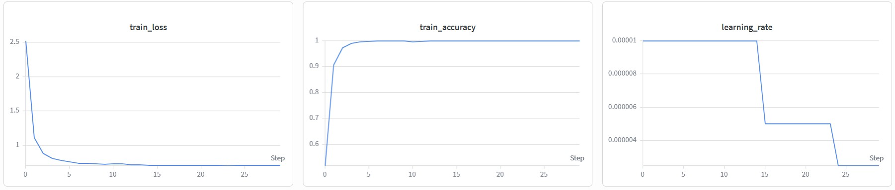
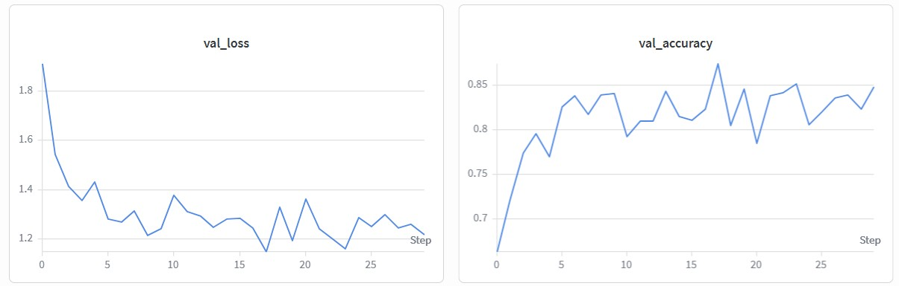

# Video Classification with UCF50

This project implements a video classification pipeline using the UCF50 dataset. It uses an enhanced bidirectional Long-term Recurrent Convolutional Network (LRCN) architecture with multi-head self-attention. A ResNet backbone extracts spatial features from individual video frames, while a bidirectional LSTM and attention mechanism model temporal relationships across frame sequences. The project includes modules for video preprocessing, training, and evaluation. Video-level data leakage was addressed through group-aware dataset splitting, the model architecture was enhanced with improved temporal modeling components, the repository was refactored, and Weights & Biases (W&B) was integrated for experiment tracking and reproducibility.

---

## Table of Contents

- [Dataset Preparation](#dataset-preparation)
- [Environment Setup](#environment-setup)
- [Preprocessing and Frame Extraction](#preprocessing-and-frame-extraction)
- [Training the Model](#training-the-model)
- [Testing and Evaluation](#testing-and-evaluation)
- [Customization and Hyperparameters](#customization-and-hyperparameters)
- [Errors Found and Fixed](#errors-found-and-fixed)
- [Model Improvements](#model-improvements)
- [Training Improvements](#training-improvements)
- [Project Structure](#project-structure)
- [Training and Testing Evidence](#training-and-testing-evidence)
- [Results](#results)
- [Discussion](#discussion)
- [Reproducibility](#reproducibility)
---

## Dataset Preparation

### Step 0: Download and Unzip Dataset

1. **Download Dataset:**  
   Download the UCF50 dataset from [UCF50](https://www.crcv.ucf.edu/data/UCF50.rar). This dataset contains videos of 50 different human action classes.

2. **Unzip and Organize:**  
   Unzip the downloaded dataset. The expected folder structure should be as follows:
   
        - UCF50
            - Action_Class1
            - Action_Class2
            ... ... ... ...
            - Action_Class50

Each subdirectory represents a different action class.

---

## Environment Setup

1. **Python Version:**  
This project requires Python 3.7 or higher.

2. **Dependencies:**  
Install the required Python packages by running:

```bash
pip install -r requirements.txt
```

### Key Libraries

- **torch**
- **torchvision**
- **opencv-python**
- **scikit-learn**
- **tqdm**
- **numpy**
- **Pillow**
- **wandb**

## Hardware Requirements

A CUDA-enabled GPU is recommended for training. The code automatically detects GPU availability.

---

## Preprocessing and Frame Extraction

Before training, the raw video files must be converted into frame sequences. The preprocessing module includes functions for:

### Uniform Frame Sampling

- The `get_frames` function uses OpenCV to sample a fixed number of frames per video.

### Saving Frames to Disk

- The `store_frames` function writes the extracted frames as JPEG images.

The preprocessing script `video_datasets.py` converts all videos into folders of extracted frames. The resulting folder structure mirrors the original dataset structure:


---

## Training the Model

### Step 1: Run Training

#### Configure Training Parameters

The training is managed via a bash script (e.g., `train.sh`) that calls the main training module.  
**Important:** Update the `--frame_dir` argument in the script to point to the directory where your preprocessed frame data is stored. You can also adjust other parameters (e.g., number of frames per video, batch size, learning rate) to see how they affect the experiment.

#### Run the Training Script

Execute the training script from your terminal:

```bash
bash train.sh
```
## During Training, the Script Will:

- **Load the frame dataset.**
- **Split the dataset** into training, validation, and test sets using group aware sampling.
- **Apply data augmentation** techniques (resizing, random flips, affine transformations).
- **Create custom PyTorch Datasets and DataLoaders.**
- **Initialize the LRCN model** using a specified ResNet backbone.
- **Set up the loss function, optimizer, and learning rate scheduler.**
- **Run the training loop** while tracking loss and accuracy, saving the best model weights.

---

## Testing and Evaluation

### Step 2: Run Testing

- **Configure Testing Parameters:**  
  Update the `--ckpt` argument in the testing script `test.sh` to point to the saved best model weights generated during training.

- **Run the Testing Script:**  
  Execute the testing script from your terminal:
  
```bash
bash test.sh
```
## Testing Script Overview

The testing script will:

- **Load the dataset splits** (previously saved during training).
- **Create a DataLoader for the test set.**
- **Load the trained model checkpoint.**
- **Evaluate the model** on the test data by computing overall accuracy, generating classification reports, and optionally producing confusion matrices.

---

## Customization and Hyperparameters

You can modify several parameters to experiment with different settings:

### Data Parameters

- `--frame_dir`: Path to your preprocessed frames.
- `--fr_per_vid`: Number of frames to sample per video.

### Model Parameters

- `--model_type`: Choose between `'lrcn'` (default) or other supported models.
- `--cnn_backbone`: Options include `resnet18`, `resnet34`, `resnet50`, `resnet101`, or `resnet152`.
- `--rnn_hidden_size` and `--rnn_n_layers`: Configure the LSTM network.

### Training Parameters

- `--batch_size`, `--learning_rate`, `--n_epochs`, and `--dropout` control the training dynamics.
- `--train_size` and `--test_size` determine dataset splits.

By tweaking these parameters, you can study their impact on model performance and experiment with different network configurations.

---

## Summary of Steps

- **Step 0: Dataset Preparation**  
  Download, unzip, and organize the UCF50 dataset into subdirectories by action class.

- **Step 1: Run Training**  
  Execute `train.sh` after configuring the `--frame_dir` and other hyperparameters to train the model.

- **Step 2: Run Testing**  
  Execute `test.sh` after updating the `--ckpt` argument to point to the best model checkpoint to evaluate the model.

## Errors Found and Fixed
- Video-level data leakage was addressed by introducing group-aware dataset splitting to ensure that frames from the same video do not appear across training, validation, and test sets.
- Added the missing video frame extraction functionality to the dataset pipeline. The original implementation only supported loading pre-extracted frame directories, so the updated version enables direct processing of raw video files by extracting and storing frame sequences automatically before training.
- Added `batch_first=True` to the LSTM to ensure the input tensor format matches the dataloader output (batch, time, feature).

## Model Improvements
- Replaced the unidirectional LSTM with a bidirectional LSTM to capture temporal dependencies in both forward and backward directions.
- Added a multi-head self-attention module after the Bi-LSTM to model long-range temporal dependencies and allow the network to learn weighted interactions between different time steps.
- Introduced Layer Normalization after temporal feature aggregation to improve training stability and convergence.
- Enhanced the classification head by replacing the single fully connected layer with a deeper MLP (Linear → ReLU → Dropout → Linear) for greater representational capacity.
- Combined attention-pooled and average-pooled temporal features to create a richer video representation before classification.
- Applied selective fine-tuning of the CNN backbone, freezing early ResNet layers while training deeper layers to better adapt pretrained features to the action recognition task.


## Training Improvements
- Enhanced data augmentation pipeline by incorporating random resized cropping, color jittering, and random rotation to increase training data diversity, improve robustness to variations in scale, illumination, and spatial transformations, and reduce overfitting.
- Processed entire frame sequences through the LSTM in a single forward pass instead of iterating frame-by-frame, improving computational efficiency and simplifying hidden state management.
- Integrated Weights & Biases (W&B) for experiment tracking, including training/validation loss and accuracy logging.

## Project Structure

```text
video_action/
│
├── src/
│ ├── models.py
│ ├── train.py
│ ├── test.py
│ ├── video_datasets.py
│ ├── utils.py
│ └── run.py
│ └── run_training.py
│ └── run.py
│ 
├── executables/
│ ├── train.sh
│ └── test.sh
│
├── logs/
│ ├── training.jpg
│ └── validation.jpg
|
├── requirements.txt
├── README.md
└── UCF50_VideoActionRecognition.ipynb

```

## Training and Testing Evidence

The jupyter notebook `UCF50_VideoActionRecognition.ipynb` shows evidence of training and testing. It does the following: 

- Clones the github repository, installs the required Python packages and imports the required libraries.
- Logs in to wandb.
- Downloads the UCF50 dataset and extracts the files.
- Runs the training script.
- Creates backup of project folder and the best model checkpoint.
- Shows training and validation curves from wandb.
- Runs the evaluation script.
- Shows the classification report.

## Results

- Training Curves

- Validation Curves

- Best Validation Accuracy - 87.38%
- **Final Test Accuracy - 83.35%**

### Classification Report

| Class | Precision | Recall | F1-Score | Support |
|-------|----------:|-------:|---------:|--------:|
| BaseballPitch | 1.000 | 0.938 | 0.968 | 16 |
| Basketball | 0.800 | 0.750 | 0.774 | 16 |
| BenchPress | 0.864 | 1.000 | 0.927 | 19 |
| Biking | 0.875 | 1.000 | 0.933 | 14 |
| Billiards | 1.000 | 1.000 | 1.000 | 19 |
| BreastStroke | 1.000 | 0.917 | 0.957 | 12 |
| CleanAndJerk | 0.593 | 1.000 | 0.744 | 16 |
| Diving | 0.783 | 1.000 | 0.878 | 18 |
| Drumming | 0.900 | 1.000 | 0.947 | 18 |
| Fencing | 1.000 | 0.714 | 0.833 | 14 |
| GolfSwing | 0.917 | 0.611 | 0.733 | 18 |
| HighJump | 0.909 | 0.667 | 0.769 | 15 |
| HorseRace | 0.762 | 1.000 | 0.865 | 16 |
| HorseRiding | 1.000 | 1.000 | 1.000 | 23 |
| HulaHoop | 0.429 | 0.214 | 0.286 | 14 |
| JavelinThrow | 0.550 | 0.688 | 0.611 | 16 |
| JugglingBalls | 0.783 | 1.000 | 0.878 | 18 |
| JumpRope | 0.533 | 0.533 | 0.533 | 15 |
| JumpingJack | 0.444 | 0.333 | 0.381 | 12 |
| Kayaking | 0.875 | 0.933 | 0.903 | 15 |
| Lunges | 0.650 | 0.650 | 0.650 | 20 |
| MilitaryParade | 1.000 | 1.000 | 1.000 | 14 |
| Mixing | 0.857 | 1.000 | 0.923 | 24 |
| Nunchucks | 0.000 | 0.000 | 0.000 | 23 |
| PizzaTossing | 0.692 | 0.692 | 0.692 | 13 |
| PlayingGuitar | 0.840 | 1.000 | 0.913 | 21 |
| PlayingPiano | 0.923 | 1.000 | 0.960 | 12 |
| PlayingTabla | 1.000 | 0.765 | 0.867 | 17 |
| PlayingViolin | 0.706 | 1.000 | 0.828 | 12 |
| PoleVault | 0.792 | 0.950 | 0.864 | 20 |
| PommelHorse | 1.000 | 1.000 | 1.000 | 12 |
| PullUps | 0.938 | 0.750 | 0.833 | 20 |
| Punch | 1.000 | 1.000 | 1.000 | 18 |
| PushUps | 0.889 | 0.667 | 0.762 | 12 |
| RockClimbingIndoor | 1.000 | 1.000 | 1.000 | 16 |
| RopeClimbing | 0.474 | 0.692 | 0.562 | 13 |
| Rowing | 0.950 | 0.950 | 0.950 | 20 |
| SalsaSpin | 1.000 | 0.778 | 0.875 | 18 |
| SkateBoarding | 1.000 | 0.692 | 0.818 | 13 |
| Skiing | 1.000 | 1.000 | 1.000 | 16 |
| Skijet | 1.000 | 1.000 | 1.000 | 12 |
| SoccerJuggling | 1.000 | 0.550 | 0.710 | 20 |
| Swing | 0.882 | 1.000 | 0.938 | 15 |
| TaiChi | 0.500 | 0.833 | 0.625 | 12 |
| TennisSwing | 0.778 | 1.000 | 0.875 | 21 |
| ThrowDiscus | 0.909 | 0.667 | 0.769 | 15 |
| TrampolineJumping | 0.824 | 1.000 | 0.903 | 14 |
| VolleyballSpiking | 1.000 | 1.000 | 1.000 | 14 |
| WalkingWithDog | 0.909 | 0.714 | 0.800 | 14 |
| YoYo | 0.941 | 1.000 | 0.970 | 16 |
| **Accuracy** |  |  | **0.834** | **811** |
| **Macro Avg** | **0.829** | **0.833** | **0.820** | **811** |
| **Weighted Avg** | **0.828** | **0.834** | **0.820** | **811** |


## Discussion

The final model achieves an overall test accuracy of **83.4%** on the UCF50 dataset, indicating strong performance across the 50 action classes. The model performs particularly well on actions with distinctive motion patterns or object interactions, achieving an F1-score of 1.0 on several classes including **Billiards, HorseRiding, MilitaryParade, PommelHorse, Punch, RockClimbingIndoor, Skiing, Skijet, and VolleyballSpiking**.

Most classes achieve high precision and recall, with many obtaining F1-scores above 0.85. However, performance is lower on classes with visually similar movements or limited temporal differences, such as **HulaHoop (F1: 0.286), JumpingJack (F1: 0.381), Nunchucks (F1: 0.000), and RopeClimbing (F1: 0.562)**. These errors are likely caused by similarities in body motion patterns between actions and the challenge of distinguishing fine-grained temporal dynamics from a limited number of sampled frames.

Overall, the enhanced LRCN architecture with bidirectional temporal modeling and multi-head self-attention provides effective spatial-temporal feature learning for UCF50 action recognition.

## Reproducibility

### Train
- Python version: 3.12.13
- PyTorch version: 2.11.0+cu128
- TorchVision version: 0.26.0+cu128
- Device: A100 GPU
- Random Seed: 0
- `cnn_backbone`: resnet50
- `rnn_hidden_size`: 256 
- `rnn_n_layers`: 2 
- `train_size`: 0.75 
- `test_size`: 0.15 
- `model_type`: lrcn 
- `n_classes`: 50 
- `fr_per_vid`: 16 
- `batch_size`: 32

### Test
- Python version: 3.12.13
- PyTorch version: 2.11.0+cu128
- TorchVision version: 0.26.0+cu128
- Device: A100 GPU
- `cnn_backbone`: resnet50
- `model_type`: lrcn
- `rnn_hidden_size`: 256
- `rnn_n_layers`: 2
- `n_classes`: 50
- `batch_size`: 32 
- Best checkpoint: `best_model_wts.pt`
- Dataset splits: `splits.npy`


Happy Training!
